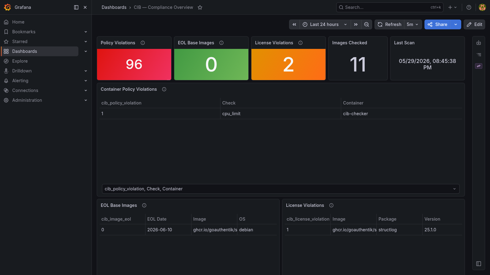

# CIB — Compliance in a Box

**One `docker compose up` to check your running containers for policy violations, end-of-life base images, and license compliance.**

CIB mounts the Docker socket, scans every running container image with Trivy (CycloneDX SBOM), checks OS EOL status via [endoflife.date](https://endoflife.date/), and validates container configurations against CIS-aligned policy — all surfaced in a Grafana dashboard.

Part of the [in-a-box-tools](https://in-a-box-tools.tech) ecosystem.



---

## What you get

| Check | What it finds |
|-------|--------------|
| **Container policy** | Privileged containers, root user, missing resource limits, no `no-new-privileges`, host network/PID |
| **SBOM + license compliance** | Copyleft or denied licenses in any package in the image (CycloneDX SBOM via Trivy) |
| **EOL base images** | Containers built on Ubuntu 20.04, Debian 10, Alpine 3.15, etc. that have passed end-of-life |

SBOMs are saved as CycloneDX JSON files to a named volume (`/data/sboms/`) for audit evidence.

---

## Quick start

```bash
git clone https://github.com/matijazezelj/cib.git
cd cib
cp .env.example .env
make up
```

Open **http://localhost:3003** — login `admin` / your `GRAFANA_ADMIN_PASSWORD`.

The first scan starts immediately (5–15 minutes, Trivy pulls license DB on first run).

---

## Requirements

- Docker + Docker Compose v2
- `/var/run/docker.sock` mounted (included in `docker-compose.yml`) **or** `DOCKER_HOST=tcp://host:port` for a remote daemon
- Outbound internet (Trivy DB + endoflife.date API)

---

## Configuration

| Variable | Default | Description |
|----------|---------|-------------|
| `GRAFANA_ADMIN_PASSWORD` | auto-generated | Grafana admin password |
| `GRAFANA_PORT` | `3003` | Host port for Grafana |
| `VICTORIAMETRICS_PORT` | `8431` | Host port for VictoriaMetrics |
| `SCAN_INTERVAL_HOURS` | `6` | Scan frequency |
| `SCAN_ON_STARTUP` | `true` | Scan immediately on start |
| `TRIVY_TIMEOUT` | `300` | Trivy timeout per image (seconds) |
| `ADDITIONAL_IMAGES` | — | Extra images to scan beyond running containers |
| `DOCKER_HOST` | — | Remote Docker daemon (`tcp://host:port`); leave unset for local socket |
| `LICENSE_DENY_LIST` | GPL/AGPL | Comma-separated SPDX IDs to flag as violations |

### Customising the license deny list

```env
# Only flag AGPL (keep GPL — maybe you're fine with copyleft for internal tools)
LICENSE_DENY_LIST=AGPL-3.0-only,AGPL-3.0-or-later
```

---

## Metrics

| Metric | Labels | Description |
|--------|--------|-------------|
| `cib_policy_violation` | `container`, `check`, `host` | 1 if the check fails, 0 if it passes |
| `cib_container_policy_score` | `container`, `host` | % of checks passing (0–100) |
| `cib_image_eol` | `image`, `os`, `version`, `eol_date`, `host` | 1 if base OS is EOL |
| `cib_eol_unknown` | `image`, `host` | 1 when no EOL data could be resolved |
| `cib_license_violation` | `image`, `package`, `version`, `license`, `host` | 1 per license violation |
| `cib_license_violations_total` | `image`, `host` | Total violations per image |
| `cib_sbom_components_total` | `image`, `host` | Total SBOM component count |
| `cib_total_policy_violations` | — | Sum of all policy violations |
| `cib_eol_images_total` | — | Count of EOL images |
| `cib_images_checked_total` | — | Images checked in last run |
| `cib_containers_checked_total` | — | Containers policy-checked in last run |
| `cib_last_scan_timestamp` | — | Last scan Unix timestamp (ms) |

### Policy checks

| Check | What it verifies |
|-------|----------------|
| `not_privileged` | Container not running in privileged mode |
| `non_root_user` | Container has a non-root user set |
| `no_new_privileges` | `--security-opt no-new-privileges` is set |
| `memory_limit` | Memory limit is configured |
| `cpu_limit` | CPU quota or NanoCPU limit is configured |
| `read_only_rootfs` | Root filesystem is read-only |
| `no_host_network` | Not using host network mode |
| `no_host_pid` | Not sharing host PID namespace |

---

## Useful commands

```bash
make up          # start the stack
make down        # stop
make logs        # follow all container logs
make scan-now    # trigger an immediate scan
make build       # rebuild checker image
make clean       # stop and delete all volumes
```

---

## VIB relationship

CIB complements [VIB](https://github.com/matijazezelj/vib):
- **VIB** → tracks CVEs in your images over time
- **CIB** → tracks configuration compliance, license policy, and OS EOL

Both push to their own VictoriaMetrics instances; both are independently deployable.

---

## In-a-box ecosystem

| Tool | What it does |
|------|-------------|
| [VIB](https://github.com/matijazezelj/vib) | Vulnerability in a Box — CVE scanning |
| [TIB](https://github.com/matijazezelj/tib) | Threat Intelligence in a Box — KEV + EPSS |
| [SIB](https://github.com/matijazezelj/sib) | Security Intelligence in a Box — alert triage |
| [AIB](https://github.com/matijazezelj/aib) | Asset Inventory in a Box — asset graph |
| **CIB** | **Compliance in a Box** |

---

## License

MIT
